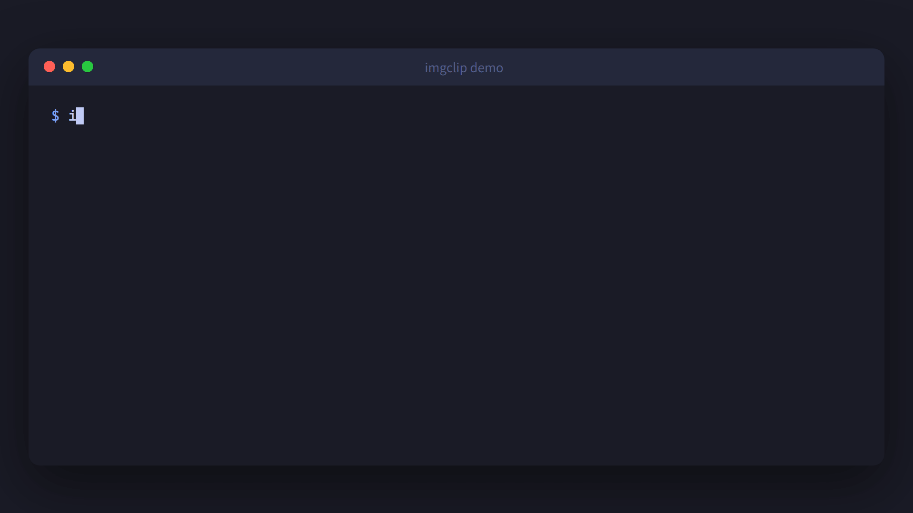

[English](#english) | [中文](#中文)

---

<a id="english"></a>

# imgclip




**Demo**

```
$ imgclip --watch
imgclip: saved ~/Pictures/imgclip/imgclip-1746359527000-1.png
imgclip: saved ~/Pictures/imgclip/imgclip-1746359595000-2.png
```

```
$ imgclip --interactive
imgclip: interactive mode — watching clipboard for changes
         [s] save  [d] discard  [q] quit
imgclip: new image (1920x1080)  [s]ave [d]iscard [q]uit? s
imgclip: saved ~/Pictures/imgclip/imgclip-1746359722000-1.png
imgclip: new image (800x600)  [s]ave [d]iscard [q]uit? d
imgclip: discarded
```

**How it works**

```
Copy / Screenshot ──▶ Clipboard ──▶ imgclip ──▶ File / stdout / data URI
                                        │
                        ┌───────────────┼───────────────┐
                        │               │               │
                     One-shot        Watch          Interactive
                    (save once)   (auto-save)    (choose per image)
```

A minimal CLI tool to extract images from the clipboard and save them as files, pipe them to stdout, or convert them to data URIs. Also copies image files **to** the clipboard. Supports a **watch mode** that automatically saves new clipboard images, and an **interactive mode** that lets you selectively save or discard each one.

## Features

- **Zero-config auto-start** — `imgclip --install` sets up login auto-start; clipboard images are saved automatically on every session.
- **Single binary, zero runtime deps** — Static release build, no installer, no framework. Just drop it in your PATH.
- **Four modes in one tool** — One-shot capture, continuous watch, interactive selective save, and file-to-clipboard copy.
- **Flexible output** — Write to file, pipe to stdout, generate a `data:image/...` URI, or create a temp file and print the path.
- **Cross-platform** — First-class support for Windows, Linux, and macOS (x86_64 + ARM).
- **Pipeline-friendly** — stdout mode and `--temp` make it easy to chain with `curl`, shell scripts, or any Unix pipeline.

## Why imgclip?

| Scenario | Other tools | imgclip |
|----------|-------------|---------|
| Screenshot tools (ShareX, Snipaste) | Need a GUI; heavy for quick capture | CLI-native, runs anywhere including SSH / headless |
| `xclip` / `pbcopy` | General-purpose, no image watch or auto-save | Purpose-built for clipboard images with `--watch` mode |
| Custom shell scripts | You maintain edge cases across platforms | Cross-platform, tested on CI (Windows, Linux, macOS) |

## Install

**Option 1: Download a prebuilt binary** (recommended)

1. Open the [Releases page](https://github.com/alexyan0431/imgclip/releases), pick the latest release, and download an asset from **Assets** (`imgclip-<target>.zip` on Windows, `.tar.gz` elsewhere).
2. Choose **`<target>`** for your OS/CPU—e.g. `x86_64-pc-windows-msvc`, `x86_64-unknown-linux-gnu`, or `x86_64-apple-darwin` (most PCs and Intel Macs); `aarch64-pc-windows-msvc`, `aarch64-unknown-linux-gnu`, or `aarch64-apple-darwin` for ARM Windows, ARM Linux, or Apple Silicon Macs.
3. Extract to get `imgclip.exe` or `imgclip`; on Linux/macOS run `chmod +x imgclip` if the file is not executable.
4. Run it with the full path to the binary, or add its folder to `PATH` if you want to type `imgclip` from any terminal.
5. Run `imgclip --version` or `--help` to verify; if Windows SmartScreen or macOS Gatekeeper blocks it, unblock in **Properties** or allow under **Privacy & Security** (macOS: `xattr -dr com.apple.quarantine path/to/imgclip` if needed).

**Option 2: Build from source**

**Prerequisites:** [Rust](https://rustup.rs/) (1.70+)

```bash
cargo install --git https://github.com/alexyan0431/imgclip.git
```

Or build manually:

```bash
git clone https://github.com/alexyan0431/imgclip.git
cd imgclip
cargo build --release
```

The binary will be at `target/release/imgclip`. Copy it somewhere in your `$PATH`.

**Windows users:** If you encounter clipboard errors, make sure the terminal session has clipboard access permissions.

## Uninstall

- **`cargo install`:** run `cargo uninstall imgclip`.
- **Prebuilt zip/binary or manual copy:** delete the executable (find it with `which imgclip` on Unix or `where imgclip` on Windows).
- **`--install` auto-start:** run `imgclip --uninstall` first to remove the login startup entry, then remove the binary using either bullet above.

## Quick Start

```bash
# One-time setup: install auto-start (watches clipboard on every login)
imgclip --install
```

That's it. After restarting (or logging in), any image you copy or screenshot will be automatically saved to `~/Pictures/imgclip/` (or `%USERPROFILE%\Pictures\imgclip\` on Windows).

To remove auto-start later: `imgclip --uninstall`. To remove imgclip entirely, see [Uninstall](#uninstall).

## Usage

### Watch Mode (Recommended)

```bash
# Start watching (saves to ~/Pictures/imgclip/ by default)
imgclip --watch

# Watch with JPEG output
imgclip --watch -f jpeg -q 90

# Watch with custom directory and poll interval
imgclip --watch --dir ~/screenshots --interval 200

# Run silently in the background
imgclip --watch --quiet
```

### One-Shot Mode

```bash
# Copy an image (screenshot, browser image, etc.), then:

# Save to a file
imgclip -o screenshot.png

# Save as JPEG with quality 90
imgclip -o photo.jpg -f jpeg -q 90

# Pipe to another command (default outputs PNG to stdout)
imgclip | some-command

# Get a data URI (useful for HTML/CSS embedding)
imgclip --data-uri

# Write to a temp file and print the path
imgclip --temp

# Suppress info messages
imgclip -o out.png --quiet
```

### Interactive Mode

```bash
# Watch clipboard and prompt for each new image: [s]ave / [d]iscard / [q]uit
imgclip --interactive

# Interactive with JPEG output
imgclip --interactive -f jpeg -q 90

# Custom save directory
imgclip --interactive --dir ~/screenshots
```

### Copy File to Clipboard

```bash
# Copy an image file to the clipboard (supports PNG, JPEG, BMP, WebP, etc.)
imgclip --copy photo.png
imgclip --copy screenshot.jpg
```

## Options

| Option | Description |
|--------|-------------|
| `--watch` | Watch clipboard, auto-save new images |
| `--interactive` | Watch clipboard, prompt to save or discard each image |
| `--copy <FILE>` | Copy image file to the clipboard |
| `--install` | Install auto-start (runs `--watch` on login) |
| `--uninstall` | Remove auto-start |
| `-o, --output <PATH>` | Write image to the specified file |
| `-f, --format <FORMAT>` | Output format: `png` (default), `jpeg`/`jpg` |
| `-q, --quality <1-100>` | JPEG quality (default: 85) |
| `--data-uri` | Output as `data:image/...;base64,...` string |
| `--temp` | Write to a temp file, print the path to stdout |
| `--dir <PATH>` | Save directory for `--watch`/`--interactive` (default: ~/Pictures/imgclip) |
| `--interval <MS>` | Poll interval in ms for `--watch`/`--interactive` (default: 500) |
| `--quiet` | Suppress informational messages |
| `-h, --help` | Print help |
| `-V, --version` | Print version |

## Examples

```bash
# Quick screenshot → clipboard → file
imgclip -o shot.png

# Embed image in HTML
echo ""

# Convert clipboard image to JPEG and pipe to curl
imgclip -f jpeg -q 80 | curl -T - https://upload.example.com

# Use in a script to auto-save screenshots
imgclip --temp --quiet | xargs -I{} mv {} ~/screenshots/

# Copy a file to clipboard, then paste into Slack/Docs
imgclip --copy diagram.png

# Selective capture: only save the screenshots you want
imgclip --interactive --dir ~/screenshots
```

## Community

- [linux.do](https://linux.do) — Linux & Open Source Community

## License

[MIT](LICENSE)

---

<a id="中文"></a>

# imgclip


**演示**

```
$ imgclip --watch
imgclip: saved ~/Pictures/imgclip/imgclip-1746359527000-1.png
imgclip: saved ~/Pictures/imgclip/imgclip-1746359595000-2.png
```

```
$ imgclip --interactive
imgclip: interactive mode — watching clipboard for changes
         [s] save  [d] discard  [q] quit
imgclip: new image (1920x1080)  [s]ave [d]iscard [q]uit? s
imgclip: saved ~/Pictures/imgclip/imgclip-1746359722000-1.png
imgclip: new image (800x600)  [s]ave [d]iscard [q]uit? d
imgclip: discarded
```

**工作原理**

```
复制 / 截图 ──▶ 剪贴板 ──▶ imgclip ──▶ 文件 / stdout / data URI
                                │
                ┌───────────────┼───────────────┐
                │               │               │
             单次模式        监听模式        交互模式
           (保存一次)     (自动保存)    (逐张选择保存)
```

一个轻量级命令行工具，从剪贴板提取图片并保存为文件、输出到 stdout 或转换为 data URI。也支持将图片文件复制**到**剪贴板。支持**监听模式**自动保存新图片，以及**交互模式**让你逐张选择保存或丢弃。

## 功能特性

- **零配置开机自启** — `imgclip --install` 一键设置登录自启，每次开机自动保存剪贴板图片。
- **单文件、零依赖** — 静态编译的 release 产物，无需安装器、无运行时框架，放入 PATH 即可使用。
- **四种模式合一** — 单次捕获、持续监听、交互式选择性保存、文件到剪贴板复制。
- **灵活输出** — 写入文件、管道输出到 stdout、生成 `data:image/...` URI、创建临时文件并打印路径。
- **跨平台** — 原生支持 Windows、Linux、macOS（x86_64 + ARM）。
- **管道友好** — stdout 模式和 `--temp` 可轻松与 `curl`、Shell 脚本或任何 Unix 管道串联。

## 为什么选择 imgclip？

| 场景 | 其他工具 | imgclip |
|------|----------|---------|
| 截图工具（ShareX、Snipaste） | 需要图形界面，快速截图偏重 | CLI 原生，可在 SSH / 无头环境中运行 |
| `xclip` / `pbcopy` | 通用剪贴板工具，无图片监听和自动保存 | 专为剪贴板图片设计，内置 `--watch` 模式 |
| 自写 Shell 脚本 | 需自行维护跨平台兼容与边界情况 | 跨平台、CI 测试（Windows、Linux、macOS） |

## 安装

**方式一：下载预编译二进制**（推荐）

1. 打开 [Releases 页面](https://github.com/alexyan0431/imgclip/releases)，选择最新版本，在 **Assets** 中下载对应压缩包（Windows 为 `imgclip-<target>.zip`，其余平台为 `.tar.gz`）。
2. 按系统与 CPU 选择 **`<target>`**—常见 PC 与 Intel Mac 用 `x86_64-pc-windows-msvc`、`x86_64-unknown-linux-gnu` 或 `x86_64-apple-darwin`；ARM Windows、ARM Linux 或 Apple Silicon Mac 用 `aarch64-pc-windows-msvc`、`aarch64-unknown-linux-gnu` 或 `aarch64-apple-darwin`。
3. 解压得到 `imgclip.exe` 或 `imgclip`；若 Linux/macOS 上无法执行，可执行 `chmod +x imgclip`。
4. 使用可执行文件的**完整路径**运行，或将所在文件夹加入 **PATH** 以便在终端任意目录输入 `imgclip`。
5. 执行 `imgclip --version` 或 `--help` 自检；若遇 Windows SmartScreen 或 macOS 安全拦截，在 **属性** 中解除锁定或在 **隐私与安全性** 中允许（macOS 可用 `xattr -dr com.apple.quarantine path/to/imgclip`）。

**方式二：从源码构建**

**前置条件：** [Rust](https://rustup.rs/) (1.70+)

```bash
cargo install --git https://github.com/alexyan0431/imgclip.git
```

或手动构建：

```bash
git clone https://github.com/alexyan0431/imgclip.git
cd imgclip
cargo build --release
```

编译产物在 `target/release/imgclip`，将其复制到 `$PATH` 中的目录。

**Windows 用户：** 如遇剪贴板错误，请确认终端会话拥有剪贴板访问权限。

## 卸载

- **通过 `cargo install` 安装：** 执行 `cargo uninstall imgclip`。
- **下载的压缩包或手动拷贝的二进制：** 删除该可执行文件（Unix 可用 `which imgclip`，Windows 可用 `where imgclip` 查看路径）。
- **曾执行过 `--install`：** 先运行 `imgclip --uninstall` 移除开机自启项，再按上两种方式之一删除程序本体。

## 快速开始

```bash
# 一次性设置：安装开机自启（登录后自动监听剪贴板）
imgclip --install
```

就这样。重启（或重新登录）后，你复制的任何图片或截图都会自动保存到 `~/Pictures/imgclip/`（Windows 为 `%USERPROFILE%\Pictures\imgclip\`）。

如需移除自启：`imgclip --uninstall`。若要彻底卸载本工具，见上文 [卸载](#卸载)。

## 使用

### 监听模式（推荐）

```bash
# 开始监听（默认保存到 ~/Pictures/imgclip/）
imgclip --watch

# 以 JPEG 格式监听
imgclip --watch -f jpeg -q 90

# 指定保存目录和轮询间隔
imgclip --watch --dir ~/screenshots --interval 200

# 静默后台运行
imgclip --watch --quiet
```

### 单次模式

```bash
# 先复制一张图片（截图、浏览器图片等），然后：

# 保存到文件
imgclip -o screenshot.png

# 以质量 90 保存为 JPEG
imgclip -o photo.jpg -f jpeg -q 90

# 通过管道传递给其他命令（默认向 stdout 输出 PNG）
imgclip | some-command

# 获取 data URI（用于 HTML/CSS 内嵌）
imgclip --data-uri

# 写入临时文件并打印路径
imgclip --temp

# 静默模式
imgclip -o out.png --quiet
```

### 交互模式

```bash
# 监听剪贴板，检测到新图片时提示 [s]保存 / [d]丢弃 / [q]退出
imgclip --interactive

# 以 JPEG 格式交互保存
imgclip --interactive -f jpeg -q 90

# 自定义保存目录
imgclip --interactive --dir ~/screenshots
```

### 复制文件到剪贴板

```bash
# 将图片文件复制到剪贴板（支持 PNG、JPEG、BMP、WebP 等格式）
imgclip --copy photo.png
imgclip --copy screenshot.jpg
```

## 选项

| 选项 | 说明 |
|------|------|
| `--watch` | 监听剪贴板，自动保存新图片 |
| `--interactive` | 监听剪贴板，逐张选择保存或丢弃 |
| `--copy <FILE>` | 将图片文件复制到剪贴板 |
| `--install` | 安装开机自启（登录时运行 `--watch`） |
| `--uninstall` | 移除开机自启 |
| `-o, --output <PATH>` | 将图片保存到指定文件 |
| `-f, --format <FORMAT>` | 输出格式：`png`（默认）、`jpeg`/`jpg` |
| `-q, --quality <1-100>` | JPEG 质量（默认 85） |
| `--data-uri` | 输出为 `data:image/...;base64,...` 字符串 |
| `--temp` | 写入临时文件，将路径打印到 stdout |
| `--dir <PATH>` | `--watch`/`--interactive` 保存目录（默认 ~/Pictures/imgclip） |
| `--interval <MS>` | `--watch`/`--interactive` 轮询间隔（毫秒，默认 500） |
| `--quiet` | 静默信息输出 |
| `-h, --help` | 显示帮助 |
| `-V, --version` | 显示版本 |

## 示例

```bash
# 快速截图 → 剪贴板 → 文件
imgclip -o shot.png

# 在 HTML 中内嵌图片
echo ""

# 将剪贴板图片转为 JPEG 并通过 curl 上传
imgclip -f jpeg -q 80 | curl -T - https://upload.example.com

# 在脚本中自动保存截图
imgclip --temp --quiet | xargs -I{} mv {} ~/screenshots/

# 复制文件到剪贴板，然后粘贴到 Slack/文档
imgclip --copy diagram.png

# 选择性截图：只保存想要的截图
imgclip --interactive --dir ~/screenshots
```

## 友链

- [linux.do](https://linux.do) — Linux 与开源技术社区

## 许可证

[MIT](LICENSE)
